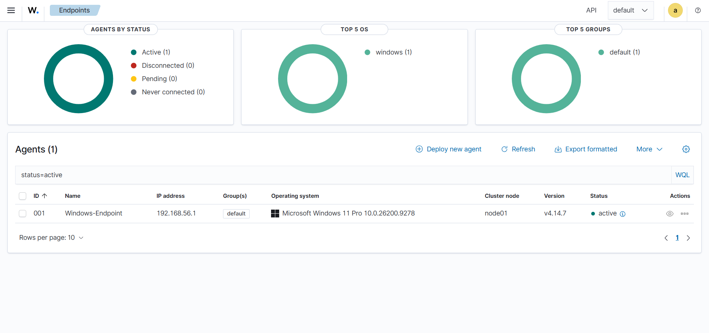
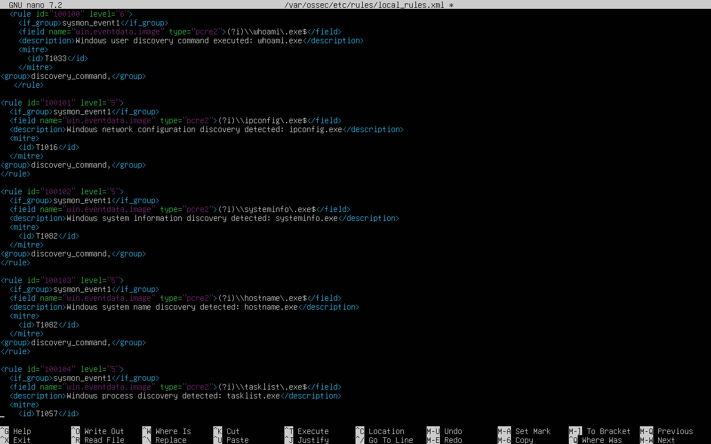
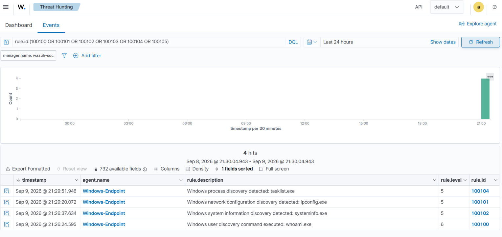
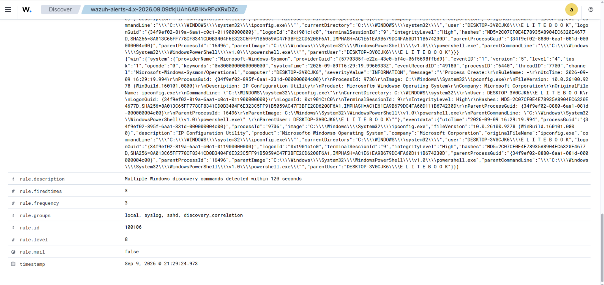

# Windows Discovery Detection with Wazuh & Sysmon

A hands-on SOC detection engineering project focused on detecting, investigating, and correlating Windows discovery activity using **Wazuh**, **Sysmon**, and **MITRE ATT&CK**.

This project demonstrates an end-to-end detection workflow from Windows process execution and endpoint telemetry to custom SIEM detection rules, alert investigation, false-positive analysis, and behavioral correlation.

---

## Project Objectives

The main objectives of this lab were to:

- Collect Windows process creation telemetry using Sysmon.
- Forward endpoint telemetry to Wazuh for security monitoring.
- Develop custom Wazuh rules for Windows discovery activity.
- Map detections to MITRE ATT&CK techniques.
- Investigate generated alerts using SOC analysis techniques.
- Analyze potential false positives.
- Correlate multiple discovery detections into a higher-severity behavioral alert.

---

## Lab Architecture

```text
┌──────────────────────────────┐
│ Windows 11 Endpoint          │
│                              │
│ Discovery Activity           │
│        ↓                     │
│ Sysmon Event ID 1            │
│        ↓                     │
│ Wazuh Agent                  │
└──────────────┬───────────────┘
               │
               │ Security Telemetry
               ▼
┌──────────────────────────────┐
│ Ubuntu Server                │
│                              │
│ Wazuh Manager                │
│ Wazuh Indexer                │
│ Wazuh Dashboard              │
│                              │
│ Custom Detection Rules       │
│        ↓                     │
│ Alert Generation             │
│        ↓                     │
│ Behavioral Correlation       │
└──────────────────────────────┘
```

### Detection Pipeline

```text
Windows Process Execution
        ↓
Sysmon Event ID 1
        ↓
Wazuh Agent
        ↓
Wazuh Manager
        ↓
Custom Detection Rule
        ↓
MITRE ATT&CK Mapping
        ↓
Threat Hunting Alert
        ↓
SOC Investigation
        ↓
Behavioral Correlation
```

---

## Technologies Used

| Technology | Purpose |
|---|---|
| Wazuh | SIEM/XDR monitoring, custom detection and alert investigation |
| Sysmon | Windows process creation telemetry |
| Windows 11 | Monitored endpoint |
| Ubuntu Server | Wazuh server environment |
| PowerShell | Controlled generation of lab activity |
| MITRE ATT&CK | Detection technique mapping |

---

## Detection Engineering

Six custom Wazuh rules were developed to detect common Windows discovery utilities through **Sysmon Event ID 1 — Process Creation**.

| Rule ID | Process | Severity | MITRE ATT&CK | Technique |
|---|---|---:|---|---|
| 100100 | `whoami.exe` | 6 | T1033 | System Owner/User Discovery |
| 100101 | `ipconfig.exe` | 5 | T1016 | System Network Configuration Discovery |
| 100102 | `systeminfo.exe` | 5 | T1082 | System Information Discovery |
| 100103 | `hostname.exe` | 5 | T1082 | System Information Discovery |
| 100104 | `tasklist.exe` | 5 | T1057 | Process Discovery |
| 100105 | `netstat.exe` | 5 | T1049 | System Network Connections Discovery |

The rules inspect the Sysmon process image field:

```xml
<field name="win.eventdata.image" type="pcre2">
```

and identify execution of the corresponding Windows utilities.

The complete rule set is available in:

[`rules/discovery_rules.xml`](rules/discovery_rules.xml)

---

## Behavioral Correlation

Individual discovery commands are not automatically malicious. Utilities such as `ipconfig`, `hostname`, and `tasklist` are also commonly used by administrators and support personnel.

For this reason, an additional correlation rule was implemented to identify repeated discovery activity within a short period.

```xml
<rule id="100106" level="8" frequency="3" timeframe="120">
  <if_matched_group>discovery_command</if_matched_group>
  <description>Multiple Windows discovery commands detected within 120 seconds</description>
  <group>discovery_correlation,</group>
</rule>
```

### Correlation Logic

- **Rule ID:** 100106
- **Severity:** Level 8
- **Frequency:** 3
- **Timeframe:** 120 seconds
- **Matched group:** `discovery_command`
- **Result group:** `discovery_correlation`

During testing, Wazuh successfully generated the higher-severity correlation alert.

The test also demonstrated that the correlation alert is associated with the event that satisfies Wazuh's correlation logic rather than creating a new synthetic event containing every discovery command as separate fields.

---

## Evidence

### 1. Windows Endpoint Integrated with Wazuh

The Windows 11 endpoint was successfully connected to the Wazuh Manager and reported as active.



---

### 2. Custom Discovery Detection Rules

Custom Wazuh rules were created for Windows discovery utilities and mapped to MITRE ATT&CK.



---

### 3. Discovery Alerts in Wazuh Threat Hunting

The custom rules successfully generated alerts for discovery activity observed through Sysmon telemetry.



---

### 4. Behavioral Correlation Alert

Rule `100106` successfully generated a **Level 8** alert after repeated discovery detections occurred within the configured correlation window.



---

## SOC Investigation

Each generated alert was reviewed using available Sysmon and Wazuh telemetry.

The investigation considered:

- Process image
- Command line
- Parent process
- Process ID
- Process GUID
- User context
- Integrity level
- Timestamp
- MITRE ATT&CK mapping
- Related discovery activity

Multiple discovery processes were observed originating from the same PowerShell session during the controlled test.

This demonstrated why an analyst should examine surrounding process and temporal context instead of evaluating an individual alert in isolation.

Detailed investigation notes are available here:

[`docs/investigation-notes.md`](docs/investigation-notes.md)

---

## False Positive Analysis

The detected Windows utilities have legitimate administrative and troubleshooting uses.

Examples include:

- Network troubleshooting
- System administration
- IT support
- System diagnostics
- Inventory and configuration checks

Therefore, execution of one discovery utility alone should not automatically be classified as malicious.

The individual detection rules use moderate severity levels, while repeated discovery activity is escalated through the higher-severity correlation rule.

An analyst should consider the user, parent process, command line, timing, related processes, and surrounding security events before escalation.

---

## Key Findings

This project demonstrated several important SOC and detection engineering concepts:

1. **Detection does not automatically mean malicious activity.** Context determines the analyst verdict.
2. **Sysmon provides valuable process telemetry** for Windows endpoint investigations.
3. **MITRE ATT&CK mapping** provides a consistent way to classify discovery behavior.
4. **Atomic detections can be noisy** when legitimate administrative utilities are monitored.
5. **Behavioral correlation adds context** by identifying multiple related detections within a short period.
6. **Parent process and temporal relationships matter** when investigating clusters of discovery activity.

All test activity in this project was intentionally generated in a controlled lab environment and classified as expected/benign.

---

## Repository Structure

```text
Wazuh-Windows-Discovery-Detection-Lab/
│
├── README.md
│
├── rules/
│   └── discovery_rules.xml
│
├── docs/
│   └── investigation-notes.md
│
└── screenshots/
    ├── 01-windows-endpoint-active.png
    ├── 02-custom-discovery-rules.png
    ├── 03-discovery-alerts.png
    └── 04-correlation-alert.png
```

---

## Skills Demonstrated

- Security monitoring
- SIEM alert investigation
- Wazuh custom rule development
- Sysmon telemetry analysis
- Windows process analysis
- Detection engineering
- Behavioral event correlation
- False-positive analysis
- MITRE ATT&CK mapping
- SOC investigation workflow
- Technical documentation

---

## Project Status

**Completed**

- [x] Wazuh and Windows endpoint integration
- [x] Sysmon process telemetry collection
- [x] Six custom discovery detection rules
- [x] MITRE ATT&CK mapping
- [x] Detection validation
- [x] SOC alert investigation
- [x] False-positive analysis
- [x] Behavioral correlation rule
- [x] Correlation testing
- [x] Evidence collection
- [x] Investigation documentation

---

## Disclaimer

This project was created for cybersecurity education and defensive security practice in a controlled lab environment. The detections and testing documented here were performed on systems within the lab.
